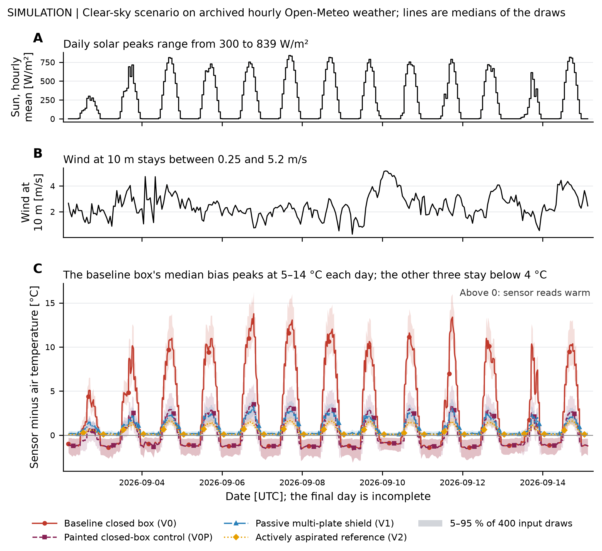

# Sensor Enclosure Bias Prediction

How much design-specific co-location can measured geometry, material and power
data plus shared thermal laws replace, at comparable prediction error? This
repository has a heat-balance model, an executed numerical correction, a literature review of its assumptions,
and a planned first-stage comparison against a reference thermometer. Transfer
to a withheld enclosure is the research direction; it has not been demonstrated.

[](https://github.com/500ft/sensor-enclosure-bias-prediction/actions/workflows/ci.yml)
[](docs/results.md)
[](.github/workflows/ci.yml)

[Results](#results) · [Roadmap](ROADMAP.md) · [Quick start](#quick-start) ·
[Pilot protocol](docs/COLOCATION_PROTOCOL.md)


*Model output, not a field measurement.
[Figure inputs](docs/data-and-figures.md#thermal-bias-plot).*

## About

An outdoor sensor can end up measuring its own enclosure instead of the air.
Sunlight heats the walls, still air traps the heat, and the electronics inside
add their own. The error changes with time of day, so a single midday check can
mislead.

The project compares enclosure options with a first-order heat-balance model,
checks the model's constants against the literature, and prepares a
co-location pilot: the enclosures mounted next to a reference thermometer for
at least a full day and night. The PI has approved the pilot in principle and offered a test
site and manufacturing help.

## Results

At 1000 W/m² of sun and 0.5 m/s of wind, the model gives these nominal point
estimates of temperature rise above ambient:

| Enclosure | Predicted rise |
| --- | --- |
| Dark closed box | 19.4 °C |
| Same box, painted white | 4.5 °C |
| Passive radiation shield | 3.0 °C |

At this operating point, changing the dark box's absorptance to the white-paint
assumption accounts for most of the predicted reduction. The shield's nominal
bias is about 1.5 °C lower than the painted box's. Geometry, internal heat load
and airflow also differ between these systems.
[Prediction table](analysis/output/thermal_bias_table.csv).

The shield-versus-painted-box ranking reverses when the documented sensitivity
settings for poorer shading, reduced convection and increased plate-air preheat
are applied together. These settings are illustrative, and this model comparison
establishes no design preference.
[Sensitivity results and assumptions](analysis/thermal_bias_results.md),
[calculation](analysis/matched_control_sensitivity.py).
At night the modelled bias can change sign, which is why the pilot covers both
day and night.

The [corrected transient calculation](docs/results.md#transient-result)
stores its initial state at the right time, conserves hourly solar input and
passes exact thermal-step and timestep-refinement checks. Its figure shows a
clear-sky assumption and sensitivity to declared inputs. Missing acquisition
metadata and actual sky forcing limit interpretation. No physical accuracy or design-transfer result has been obtained.



*Archived hourly forcing with a stated sky scenario, not rig measurements.
[Inputs, method and reproduction](docs/data-and-figures.md#transient-prediction-plot).*

Other work in the repository:

- **Literature.** A [26-source matrix](literature/literature_matrix.csv) with
  [source assessments](ProConsList/README.md), and a later review of 27 more
  sources against the model's previously uncited constants.
- **Uncertainty.** The steady tables are point estimates. The transient
  draft carries sensitivity bands from assumed uniform ranges by Monte Carlo. The
  standalone [linear propagation module](analysis/uncertainty.py) is tested but
  not connected to either.
- **Reliability accounting.** [Schedule-aware metrics](docs/RELIABILITY_METRICS.md)
  for deployed units. The historical percentages need raw exports that are not
  in this repository, so they are reported but unverified.
- **CAD.** The baseline enclosure is parametric and was accepted against an
  independent closed-form check of volume, bounding box and STEP re-import.

## Quick start

Python 3.12, the CI version. These checks use only files in the repository.

```bash
git clone https://github.com/500ft/sensor-enclosure-bias-prediction.git
cd sensor-enclosure-bias-prediction
python -m venv .venv
source .venv/bin/activate
python -m pip install -r requirements.txt
python -m compileall -q analysis
PYTHONPATH=. python -m unittest discover -s analysis/tests -v
python analysis/check_literature_coverage.py
```

To regenerate the model tables without overwriting the committed ones:

```bash
OUT_DIR="$(mktemp -d)"
python analysis/thermal_bias.py --no-figure \
  --table "$OUT_DIR/thermal-day.csv" \
  --night-table "$OUT_DIR/thermal-night.csv"
diff -u analysis/output/thermal_bias_table.csv "$OUT_DIR/thermal-day.csv"
diff -u analysis/output/thermal_bias_night_table.csv "$OUT_DIR/thermal-night.csv"
```

No diff means the tables reproduce in your environment. The
[reading guide](docs/START_HERE.md#reviewer-reproduce-the-contained-analysis)
covers external-data prerequisites and the intake checker.

## What's next

The [roadmap](ROADMAP.md) orders prerequisites and completion evidence without
a schedule. Owner decisions and qualified rig measurements come first, followed
by identifiability and measurement capability, I1 at known airflow, registered
field interventions, and withheld-design calibration/effort comparisons.

The first stage remains estimation-only. A later skip-co-location claim needs
an agreed application tolerance. The [owner record](docs/COLOCATION_OWNER_SESSION.md#current-blocker)
holds the pending inputs; neither this cleanup nor the merged numerical result
closes physical gates. Total effort includes geometry/material/power acquisition,
setup, calibration and deployment. External designs or exposure regimes are
conditional extensions.

## Limits

- The published steady model is lumped; the transient extension has no field data yet. One 24-hour campaign would not
  establish seasonal accuracy.
- The pilot protocol is a draft until it is frozen with its approver and date.
  Its data-quality targets are proposals, and the model's day and night
  scenarios are not acceptance limits.
- The intake checker catches malformed data. It cannot prove where data came
  from, and a file that passes it is not a thermal validation.

## Documentation

| Document | What it covers |
| --- | --- |
| [Reading guide](docs/START_HERE.md) | Where to start |
| [Results](docs/results.md) | What is modelled, provisional or unavailable |
| [Data and figures](docs/data-and-figures.md) · [manifest](docs/figure-manifest.json) | Where each plot and input came from |
| [Model assumptions](analysis/thermal_bias_results.md) | Geometry, radiation and convection terms |
| [Pilot protocol](docs/COLOCATION_PROTOCOL.md) | What the side-by-side test measures |
| [Owner decisions](docs/OWNER_DECISIONS_2026-09-24.md) | Open questions for the pilot |
| [Working manuscript](paper/manuscript_v1.md) | Literature and analysis written up |
| [Geometry reference](docs/cad_geometry_reference.md) | Retained CAD inputs and geometry checks |

```text
analysis/      thermal and reliability models, intake checks, tests and figures
literature/    source matrix and design comparisons
ProConsList/   per-source assessments
paper/         working manuscript and bibliography
templates/     record templates for baselines, deployments and calibration
docs/          methods, results and protocols
evidence/      recorded checks
```

## Contributing and reuse

Read [CONTRIBUTING.md](CONTRIBUTING.md). Literature changes must keep the
bibliography, matrix, assessments and synthesis in sync. Analysis changes need
a reproduction, units, input sources and tests.

There is no open-source license yet; contact the owner about reuse or about
the nonpublic data. When referencing the work, give the commit and say that
the results are modelled. The project's earlier name is explained in the
[identity note](docs/REPOSITORY_IDENTITY.md).
