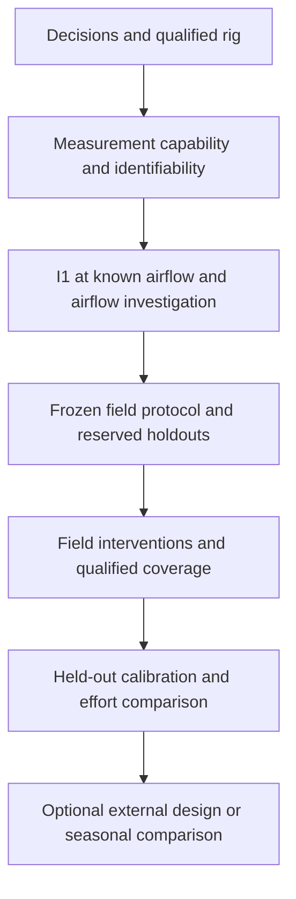

# Roadmap

This is the only active plan. The [owner record](docs/COLOCATION_OWNER_SESSION.md#current-blocker)
holds decisions and physical prerequisites; the [protocol](docs/COLOCATION_PROTOCOL.md)
holds acquisition rules. [Results](docs/results.md) and [history](docs/history/README.md)
separate executed evidence from retired proposals.

## Question and finish line

How much design-specific co-location can measured geometry, material and power
data plus shared thermal laws replace, at comparable prediction error?

Finish with a reproducible comparison of held-out prediction error and total
measurement/calibration effort, including cases where target fitting is still
needed. The first-stage floor is an estimation-only report of temperature bias,
uncertainty and model error beside a calibrated reference. No pass/fail verdict
is required. A later claim that co-location can be skipped needs a prospective
application tolerance agreed with the PI. Publication is a separate decision.

Total effort includes geometry, material and power characterization, equipment
setup, calibration, co-location and deployment. Report the effort/error tradeoff
when no application tolerance has been adopted. If target coefficients must be
fitted, quantify the remaining calibration rather than claiming zero calibration.

## Verified starting point

- **Done:** corrected transient integration, exact-RC and interval-energy checks,
  refinement checks, explicit sky scenarios and assumed-input sensitivity.
  [The merged result](docs/results.md#transient-result) retains missing acquisition
  provenance as unknown; it is not a physical validation.
- The [steady comparison](analysis/thermal_bias_results.md) and combined
  sensitivity calculation remain reproducible. Their ranking reversal establishes
  no design preference. The [uncertainty module](analysis/uncertainty.py) is
  tested separately from those point estimates.
- The [baseline CAD](cad/enclosure/v0/README.md) has recorded geometric checks.
  It does not establish the new rig inventory or thermal performance.
- The [external-data probe](analysis/aqspec_feasibility.md) obtained reports but
  no qualified paired temperature series. That route is optional.
- **Current blocker:** owner-held rig, calibration, design/replication and funding
  inputs in the [owner record](docs/COLOCATION_OWNER_SESSION.md#current-blocker).
  The thermal campaign has not run. In-principle PI support is already recorded.

## Dependency order

### M1. Resolve decisions and qualify the rig

Status: current, blocked on owner inputs.

Prerequisites: the recorded in-principle PI support and owner access to actual
hardware, calibration records and site/data terms. The owner-authorized research
question and estimation-only choice remain selected.

Tasks:

- Seek PI feedback in the owner's chosen in-person discussion on calibration
  transfer and the application-tolerance requirement for any later
  skip-co-location claim. Record feedback in the
  [owner record](docs/COLOCATION_OWNER_SESSION.md#current-blocker); the adopted
  direction and estimation-only first stage remain selected.
- Confirm designs, independently built units or swaps, logging arrangement,
  funding receipt and site/data permissions. Proposed design counts are targets
  pending qualification, not a sample-size justification or an inventory.
- Record enclosure/sensor IDs, reference thermometer and its shield/aspiration,
  calibration certificate and uncertainty, loggers, electrical-power measurement
  and airflow instrumentation. Check synchronization, positions and fan decoupling.
- Preserve CAD and material records that describe the actual specimens. Use the
  [geometry reference](docs/cad_geometry_reference.md) only where it applies.

Completion evidence: reviewed inventory and calibration/uncertainty records,
verified logging/power/airflow capability, site/data terms and an explicit record
of remaining unknowns. These qualify preparation; they do not freeze a campaign.

### M2. Establish what the interventions can identify

Status: future; depends on M1 and permission for the actual bench procedure.

Before fitting, assess plausible parameter and noise ranges, measurement
capability, confounding and independent input variation using development data
only. Local sensitivity at one nominal point cannot establish practical
identifiability. Choose measurements/interventions that distinguish the desired
quantities, or reduce the model and claim.

- Run I1 first: controlled resistive-power steps in dark conditions at documented
  airflow, with measured power and temperatures and repeated/counterbalanced states.
- In the single-node limit, the response identifies effective heat/conductance
  and capacity/conductance. Supply power needs an identified heat path before
  absolute material or convection parameters can be inferred.
- Investigate airflow independently of power. Estimate a convection relation only
  if geometry, effective area, heat coupling and measured airflow provide enough
  independent information; otherwise report combinations and uncertainty.

Completion evidence: qualified raw records, uncertainty and residual checks,
repeatability, identified parameter combinations and their supported domain,
and a documented choice of model. An unresolved combination or inadequate
measurement is a useful scoped result; it is not evidence that the physics failed.

### M3. Register and execute field comparisons

Status: future; depends on M2, qualified reference measurements and owner/PI
approval of the concrete protocol.

Before acquisition or exposure to evaluation outcomes, freeze the protocol,
model, coefficients, processing, weather-input procedure, metrics, calibration
budgets and independent design/unit/period holdouts. Keep evaluation observations
unseen during model choice. Distinguish independently measured deployment inputs
from coefficients fitted using target outcomes.

- Use approved designs and independent replicates or swaps. Specify comparisons
  the available units can support; repeated samples are not independent units.
- Acquire reference, sensor, power, airflow, irradiance and sky information under
  the [protocol](docs/COLOCATION_PROTOCOL.md). Preserve I1 first and counterbalance
  subsequent shading, including its airflow and long-wave confounding.
- Judge coverage from measured day/night, irradiance, wind and intervention
  conditions. Lamp spectra and climatology do not qualify outdoor solar coverage.
- Respect the approved acquisition ceiling. Missing coverage at that ceiling is
  incomplete acquisition; extending it requires a new owner/PI decision.

Completion evidence: frozen registration, immutable raw files with provenance,
calibration and state records, coverage/missingness report and evidence that the
claimed contrasts have adequate independent variation. Passing intake alone does
not validate the model. Write up the first-stage bias/uncertainty result even if
transfer cannot yet be qualified.

### M4. Compare withheld-design calibration and total effort

Status: future; depends on qualified M3 data, an untouched evaluation set and
prespecified calibration allocations and baselines.

Compare shared thermal prediction with a constant correction, a limited
co-location regression, a simpler thermal model and full target calibration.
Keep evaluation observations outside every permitted fitting budget. Report
bias, prediction error and interval coverage by exposure regime, with uncertainty
that respects shared references, temporal dependence and independent units.

Completion evidence: reproducible held-out comparisons and an effort/error
accounting covering physical-input acquisition, setup, calibration and deployment.
State which measured inputs or target fitting were still needed. Write up weak
transfer or no effort saving as results; reserve a skip-co-location verdict for
an approved application tolerance and adequate evidence.

### M5. Optional external design or seasonal comparison

Status: conditional; depends on M4, a distinct question, adequate resources and
newly qualified data/permissions. It is not required to report the first-stage result.

An external design, another exposure regime or a PurpleAir comparator needs
reuse terms, matched reference channels, construction/exposure metadata and a
split frozen before evaluation. The existing external-data probe does not meet
those requirements. No author outreach is authorized by this roadmap.

Completion evidence: a separately scoped, reproducible external comparison with
its independence and limits stated. Cold-climate heating, PM-correction changes,
CFD/CHT and structural qualification need separate evidence and authorization;
they are not default branches of this work.
