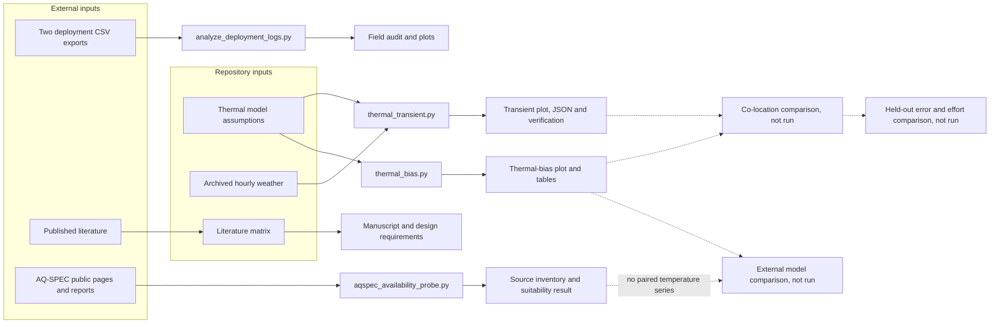

# Data and figure production

This document explains where the repository's reported data come from, how each
result figure is produced, and which parts can be reproduced from the clone
alone.



## Evidence classes

| Class | Meaning in this repository |
| --- | --- |
| Field-log analysis | Calculations made from device exports collected during bench and outdoor operation |
| Analytical simulation | Lumped steady-state and single-node transient heat-balance calculations, without a spatial mesh |
| Literature synthesis | Values extracted or summarized from cited publications |
| External-data probe | Retrieval and inspection of public sources; no measurements extracted |
| Planned analysis | CAD, FEA, calibration, or validation steps that do not yet produce results |

## Deployment-log plots

Generator: [`analysis/analyze_deployment_logs.py`](../analysis/analyze_deployment_logs.py)

Required external files:

- `data1.3_24 - Sheet1.csv` (Log A)
- `data2_5_29 - Sheet1.csv` (Log B)

The script requires an explicit data directory; it has no machine-specific
default. The path below is a placeholder for authorized external exports:

```bash
python analysis/analyze_deployment_logs.py \
  --data-dir /path/to/DataEnclosure \
  --out-dir analysis/output
```

The audit parses timestamps, treats `reset_reason == "BROWNOUT"` as a brownout
row, treats `last_post_ok == 1` as a successful post, replaces battery
temperature sentinels at or below −40, and flags `hum == 0` environmental rows.
An operational row requires `DEEPSLEEP_WAKE` and humidity above zero. The
provisional outdoor window for Log A is 2026-04-20 through 2026-05-11.

That window is retained for exploratory descriptive summaries, not used to
invent configured completeness. Since the 2026-09-05 accounting correction,
completeness is unavailable unless an intended start/end and cadence are
supplied. New output must be kept separate from historical published field
rates until their denominators are reconciled. See [RELIABILITY_METRICS.md](RELIABILITY_METRICS.md).

The command writes `analysis/output/results.md` plus four plots. Three are kept
in `analysis/figures/` under publication-oriented names:

| Committed output | Script output before copy/rename |
| --- | --- |
| `deployment_daily_brownout.png` | `fig1_daily_brownout_fraction.png` |
| `deployment_battv_outcome.png` | `fig3_battv_by_outcome.png` |
| `deployment_temp_window.png` | `fig4_temp_deployment_window.png` |

It also writes filtered CSV subsets beside the raw input under `derived/`.
Those subsets and the source exports are intentionally outside version control.
The script records input SHA-256 prefixes in its generated report so a run can
be tied to specific source files.

## Thermal-bias plot

Generator: [`analysis/thermal_bias.py`](../analysis/thermal_bias.py)

```bash
python analysis/thermal_bias.py
```

The script solves a lumped steady-state energy balance for absorbed solar and
internal heat against convection and long-wave radiation. It converts predicted
sensor temperature rise into relative-humidity error at fixed water-vapor
partial pressure, sweeps solar loading and wind speed, and writes
`analysis/figures/thermal_bias.png` and its SVG companion. The shared legend
uses the same variant colors and markers as the transient plot; solid and dashed
lines distinguish solar loading. RH differences are in percentage points.

The assumptions are encoded in the script and tabulated in
[`analysis/thermal_bias_results.md`](../analysis/thermal_bias_results.md). The
model is not fitted to the deployment logs. Its comparison with published
measurements is a literature bracket, not a validation using this enclosure.

## Transient prediction plot

The [corrected JSON](../analysis/output/thermal_transient_prediction.json) and
figure come from [`analysis/thermal_transient.py`](../analysis/thermal_transient.py).
Reproduce into fresh paths:

```bash
python -m analysis.thermal_transient --json /tmp/enclosure-transient.json --figure /tmp/enclosure-transient.png
python -m analysis.verify_thermal_transient --out /tmp/enclosure-verification.json
```

The [weather bytes](../analysis/input/openmeteo_brooklyn_20260901_20260914.json)
are unchanged. Their acquisition request, retrieval date and product/version
are unknown. The output records the hash, source definitions, time support and
integrated radiation energy. Instantaneous inputs are interpolated; solar means
are constant over their preceding hours. Figure timestamps are UTC and the
final partial day is excluded from mean daily peaks, while its intervals remain
in duration-weighted means.

The PNG and SVG separate solar and wind forcing into aligned panels. Median
lines use both marker shapes and line patterns; neither markers nor lines
subsample the calculation. The primary plot uses an explicit clear-sky assumption with uniform input
sensitivity bands. The JSON also reports a nominal fully opaque sky scenario.
Total cloud cover is not silently substituted for opaque cover. These are
assumptions, not measured sky forcing or a calibrated prediction interval.
[Verification](../analysis/output/thermal_transient_verification.json) records
exact-RC error, energy preservation and timestep refinement for nominal and two
joint parameter corners under both sky assumptions. It does not check every
parameter combination or establish physical accuracy. [Review status](results.md#transient-result)
and [original artifacts](history/README.md) distinguish current and superseded outputs.

## External-data suitability probe

Generator: [`analysis/aqspec_availability_probe.py`](../analysis/aqspec_availability_probe.py)

```bash
python3 analysis/aqspec_availability_probe.py /absolute/external/aqspec-probe
```

The probe needs network access, `curl` and Poppler's `pdftotext`. It writes
downloads and extracted text to the external directory. The committed
[source inventory](../analysis/results/aqspec_source_inventory.json) and the
[suitability result](../analysis/aqspec_feasibility.md) are its only outputs in
git. No figure is produced: the probe found no paired sensor/reference
temperature series to plot.

## Literature records and report visuals

`literature/literature_matrix.csv`, the bibliography, the cross-source summary,
and `ProConsList/` form the source-traceability layer. Run:

```bash
python analysis/check_literature_coverage.py
```

The files under `deliverables/` and their rendered preview pages are document
layouts built from this material. They are not additional experimental results
and are excluded from the figure manifest.

## Reproduction boundary

The literature coverage check and both thermal models run from
repository-contained inputs. The AQ-SPEC probe re-downloads public sources, so
its result depends on what those sites serve at the time. Deployment plots
require the two external CSV exports. Accuracy, calibration, heat-soak, and
spatial FEA plots cannot be regenerated because their planned input data or
solver implementation do not yet exist.

[`figure-manifest.json`](figure-manifest.json) provides the same figure lineage
in a machine-readable form.

## Visual revision and retained material

Both thermal figures take their colours, markers and text sizes from
[`analysis/figure_style.py`](../analysis/figure_style.py). Each variant has one
colour and marker in both plots. Every pair of variant colours stays distinct in
a deuteranopia and protanopia simulation; the baseline box stays red and the
shield blue. Weather inputs are black and the zero line light grey, so no
neutral mark matches a variant colour. Panel titles state each panel's result and are computed from the plotted
values. No inputs, draws, exclusions, summaries or uncertainty interpretation
changed. Steady Markdown tables name each variant with its code in parentheses,
put units in headings and keep their CSV links.

| Active visual or table | Treatment and reason |
| --- | --- |
| Steady thermal figure | Result titles, variant key and solar-load key above the panels, in-panel sign cues, panel letters; PNG and SVG |
| Transient figure | Result titles, black forcing traces on a shared UTC axis, variant and band key below the data, draw count in the key; PNG and SVG |
| README prediction table and steady result tables | Variant names with codes, units in headings, numeric alignment, consistent display precision and source CSV |
| Deployment figures and historical metrics | Original images/values retained because source exports are unavailable; full-width summaries and evidence captions improved |
| Overview diagram and roadmap dependency graph | Retained: conceptual dependencies, with no numerical axes to redesign |
| Frozen manuscript, deliverables and archived evidence | Retained unchanged to preserve historical release and evidence provenance |

Both plotting functions write the requested image at 300 dpi and a same-name
SVG beside it. The SVG has no date stamp and fixed element ids, so a rerun in
the same environment gives the same files.
Use temporary result paths in the commands above to preserve the committed
numerical records and their original software hashes. The figure manifest lists
the figure-only outputs and their result sources. The source-file hash in a
historical result identifies that result's generator version, not the latest
plotting-only revision.
