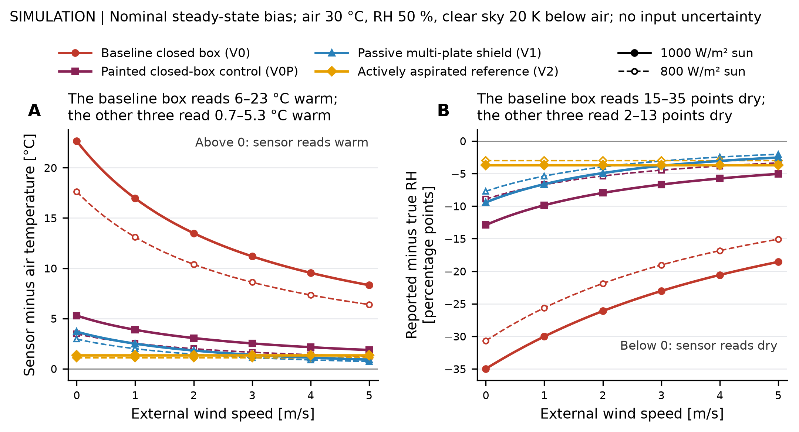

# Results

This page collects the current outputs. It separates deployment-log observations
from analytical predictions because they have different evidence sources and
validation requirements.

## Deployment-log reliability

The first audit uses two CSV exports stored outside this repository. The outdoor
window is inferred from the internal temperature and humidity signature and
still needs confirmation against the deployment record.

For the provisional 22-day outdoor window in Log A, the manuscript reports:

| Metric | Result |
| --- | ---: |
| Upload success | 95.7% |
| Data completeness | 91.4% |
| Brownout resets | 0 |

These values describe delivery and continuity, not measurement accuracy. A
reference co-location dataset is still required for accuracy and calibration
claims.

**Accounting correction, 2026-09-05:** the numbers above are historical,
reported-but-unverified outputs retained for traceability. The former estimator
counted rows over an observed span and unconfirmed six-minute cadence; duplicate
rows and missing edge intervals could inflate completeness. The revised code
requires an explicit intended schedule and counts unique occupied slots. No
revised field percentage has been computed without the private exports and
confirmed provenance. Upload success is a fraction of received records, not
end-to-end delivery probability or wall-clock uptime. See
[metric definitions](RELIABILITY_METRICS.md) and the
[prepared provenance request](DEPLOYMENT_PROVENANCE_REQUEST.md).

| Deployment window | Battery voltage by record outcome |
| --- | --- |
|  |  |

The full audit script defines brownout rows, successful posts, missing-value
sentinels, environmental QC flags, and the operational-row filter. Raw CSVs are
not included, so another user cannot independently regenerate these field plots
without obtaining the source exports.

## Thermal-bias model

The [committed day table](../analysis/output/thermal_bias_table.csv) contains
nominal point estimates for the dark box, painted control and shield variants.
The [model interpretation](../analysis/thermal_bias_results.md) records their
assumptions and the combined sensitivity settings that reverse the shield's
nominal advantage over the painted box. Geometry, heat coupling and airflow
differ across those systems, so this comparison establishes no design preference.

The table and figure omit propagated input uncertainty. The standalone
[uncertainty module](../analysis/uncertainty.py) is not connected to them.
These are analytical outputs; no physical thermal comparison or FEA validation
is supplied by this figure.

## Transient result

[PR #56](https://github.com/500ft/sensor-enclosure-thermal-design/pull/56)
merged the corrected sensitivity calculation and [executed numerical
verification](../analysis/output/thermal_transient_verification.json).
The [prediction JSON](../analysis/output/thermal_transient_prediction.json) is
the source for the current scenario summaries, parameter draws, paired signed
contrast, finite heat secant and weather provenance. The owner approved the merge on 2026-10-06
after an agent inspection of the corrected integration loop. The prediction
JSON's `status` field was written before that approval and still says HOLD; it
changes at the next regeneration. [Original artifacts](history/README.md) remain available.

| Review item | Implemented correction and evidence |
| --- | --- |
| Initial state and integration | Save the initial state at its timestamp; integrate actual intervals with midpoint instantaneous forcing and a local exponential tangent step. Exact-RC, irregular-step, zero-loss and nonlinear-refinement checks exercise the actual solver. |
| Forcing time | Hold each preceding-hour solar mean over its source interval, retaining every hourly boundary. Check timestamps and units. Exclude the unsupported first solar hour; stop at the final timestamp. Use duration-weighted means and complete-day peaks; report partial-day support and absolute UTC labels. |
| Provenance and sky model | Keep raw weather bytes/hash. Request, retrieval date and product/version remain explicitly unknown. Replace the hybrid with the sourced Clark-Allen clear-sky equation and Walton opaque-cloud correction. Because the file supplies total cloud rather than opaque cloud, report explicit clear and fully opaque scenarios, not inferred sky measurements or guaranteed bounds. |
| Interpretation | Uniform assumed-input quantiles remain sensitivity ranges. A shared-draw V1-minus-V0P signed-bias contrast is reported directly; marginal overlap supplies no paired inference. The I1 calculation is a finite secant per effective coupled heat, with its steady sky assumption stated. It does not identify supply-to-sensor heat coupling. |
| Decisions and registration | Record owner-authorized geometry/calibration-transfer direction while retaining estimation-only first-stage reporting, I1 first and PI/physical gates. The model, processing, coefficients and weather procedure must be frozen before later outcomes. |
| Integration and review | Current main is incorporated. Only transient outputs were regenerated after the corrections and numerical checks; raw weather and steady tables remain unchanged. Merged on owner approval; unresolved acquisition evidence remains explicit. |

The [Open-Meteo definitions](https://open-meteo.com/en/docs/historical-weather-api)
identify the solar interval convention and total cloud variable. The
[EnergyPlus equation and opaque-cover definition](https://energyplus.readthedocs.io/en/stable/auxiliary-programs/auxiliary-programs.html#field-horizontal-infrared-radiation-intensity)
support the implemented sky scenarios. Neither source recovers this file's lost
acquisition details. Hourly grid forcing cannot establish minute-scale exposure
at the rig. Assumed input ranges and sky scenarios do not yield calibrated
prediction intervals or a measured design ranking.

The thermal-step check supports the single-node reasoning: the steady step
identifies effective heat divided by conductance; the time constant identifies
capacity divided by conductance. Electrical power requires an identified heat
path. The correction does not establish multi-node or cross-geometry
identifiability. See the [I1 protocol](COLOCATION_PROTOCOL.md#i1-procedure-the-first-experiment)
and [current blocker](COLOCATION_OWNER_SESSION.md#current-blocker).

### RH interpretation

At fixed vapor partial pressure, `RH_sensor = RH_air * e_sat(T_air) /
e_sat(T_sensor)`. The [executed sensitivity calculation](../analysis/output/thermal_transient_verification.json)
records the temperature and humidity assumptions and the resulting percentage-point
errors. Moisture exchange or condensation would change this derivation. An
empirical PM correction trained on internal RH cannot automatically substitute
ambient RH without revalidation. No universal PM benefit or binding application
tolerance follows from this thermal calculation.

## Reading the evidence

| Output | Evidence type | Current limitation |
| --- | --- | --- |
| Deployment metrics and plots | Analysis of external field logs | Raw exports and confirmed deployment history are unavailable in the repository |
| Thermal-bias sweep | First-order analytical simulation | Parameters require lab measurement and co-location comparison |
| Literature brackets | Published measurements summarized from cited sources | Not measurements of this enclosure |
| [Retained CAD](../cad/enclosure/v0/README.md) | Geometric acceptance evidence | Does not establish the current rig or thermal performance; unused FEA stub removed |

See [`data-and-figures.md`](data-and-figures.md) for the complete production path
and [`figure-manifest.json`](figure-manifest.json) for the machine-readable map.
